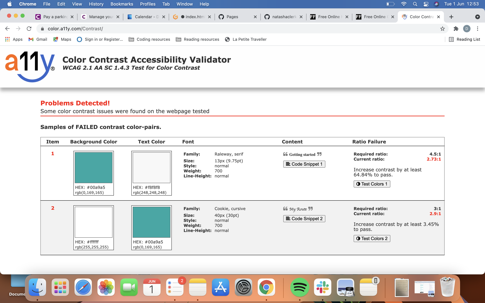
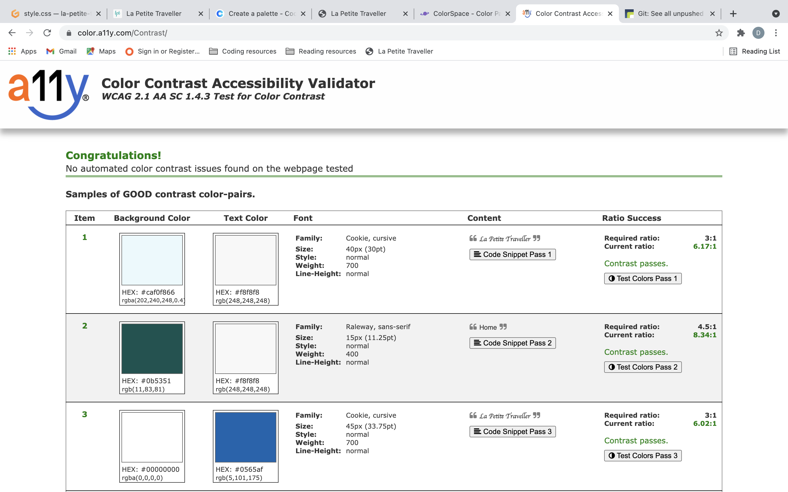
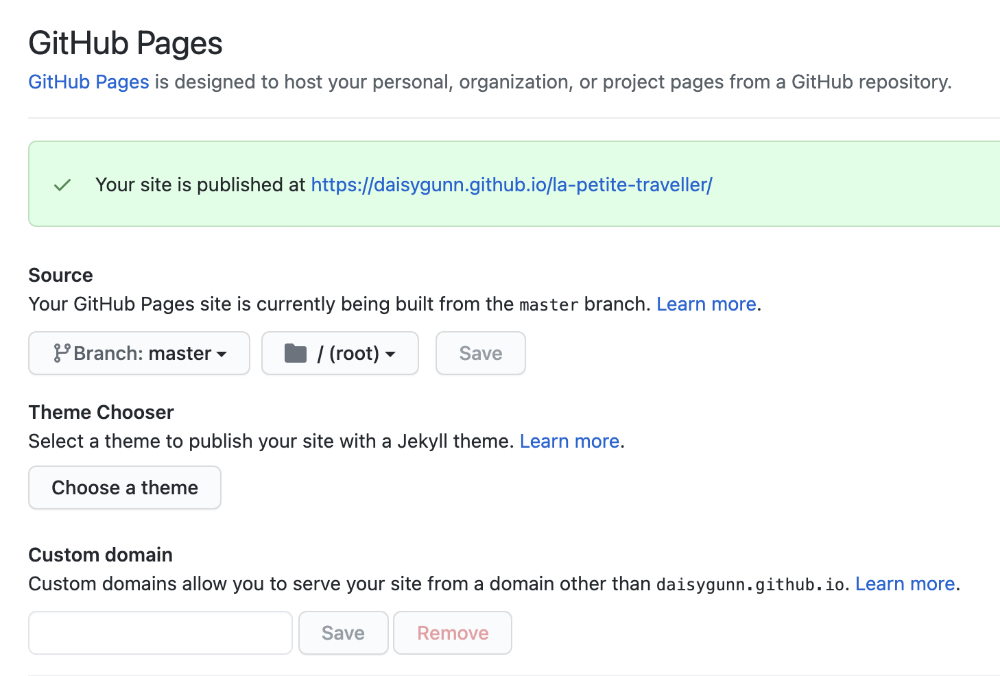

# La Petite Traveller

[Visit the website here](https://daisygunn.github.io/la-petite-traveller/)

This website was created to provide guidance and inspiration for people interested in backpacking; furthermore those specifically interested in visiting Sri Lanka as that is the 'recent trip' currently featured on this website. This website was made for educational purposes only.

This website is made up of the following sections:

1. Introduction
2. Travel Tips 101
3. Guide for the most recent trip the author has taken, in this case, Sri Lanka
4. Form to sign up to La Petite Traveller's newsletter

The business goals for this website are:

1. To advise users on how to backpack and travel around the world on a budget
2. To inspire users to visit countries that have been reviewed
3. Earn commission from links provided (hotels, restaurants, products)
4. Build a database of users to send future information & content to, thus furthering the reach of the author.

The user goals of this website are:
1. As a first-time visitor, I want to easily find useful information & tips for travelling/backpacking.
2. As a first-time visitor, I want to find inspiration for planning future trips.
3. As a first-time visitor, I want to find a helpful guide on Sri Lanka, with possible routes to take and options available.
4. As a recurring or first-time visitor, I want to find recommendations from a trusted source for restaurants/hotels/products.
5. As a recurring or first-time visitor, to easily find affiliate pages for the author, with even more inspiration available.
6. As a first-time user, I want to be able to sign up to directly receive content via a newsletter.

## UX
---
### **Strategy**

Considering the core UX principles I first started to think about the strategy for this website and defined who the target users would be and what features/technologies they would want.

La Petite Traveller's target users are:
* Aged 18-30
* Past/future backpackers
* People interested in travelling on a budget
* Have an interest in visiting Sri Lanka

What these users would be looking for:
* Clear, concise, easy-to-find information
* Beautiful photos that provide inspiration and make the destinations look desirable
* Helpful guidance on routes available
* Recommendations for where to eat/stay

This website will offer all of these things whilst also allowing for intuitive navigation and comfortability of use. An effort was taken to not provide an overwhelming amount of information at first glance as this is often the reason people are put off with travel guides.

Due to the age group of the users, it is assumed that most users will be viewing the site on their mobile phones and therefore creating something responsive is integral to the design.

### **Scope**

In order to achieve the desired user & business goals, the following features will be included in this release:

- Header and menu bar, to navigate to various sections of the page
- Information section full of tips for backpacking
- Downloadable Checklist of things to pack
- Ratings of a recent trip to Sri Lanka
- Interactive map of the route taken
- Information, recommendations and advice for travelling Sri Lanka
- Gallery of images from the Sri Lanka trip
- Newsletter sign up form
- Links to affiliate social media pages

### **Structure** 

This website is a single-page website to allow for desired flow; the navigation bar at the top allows for users to easily move to whatever section of the site they are interested in or they can simply scroll through the information as it is displayed. I chose the following order for the information 'Home > Travel Tips 101 > My Last Trip > Keep in Touch', as I felt this would allow the information to be digested in the best way. The text blocks are broken up with images to ensure interest is kept and there is no information overload at any point. There is a concise review of Sri Lanka before the more in-detail guide as I wanted users to be able to find these key bits of information quickly. Finally, there is a simple sign up form for users to sign up to the La Petite Traveller's newsletter.

### **Skeleton**
[Wireframes](wireframes.pdf/wireframes_la_petite_traveller.pdf)

Please note the actual website has changed slightly from these wireframes.

Whilst building the website I felt that there were sections with too much information, for this reason, I opted to install the read more button on all devices and not just the mobile. This allows for user's to only read on if they would like the more detailed information; I felt giving the user this control would provide a positive user experience. 

I also decided to change my photo slideshow to a Fancybox gallery as I felt it looked cleaner and I preferred this method of interaction, it also allowed for better responsiveness and the images looked better on larger screens. 

In addition to these changes I also decided to add an animated arrow between the heading for the newsletter sign up form and the form itself, I felt that this was an engaging element that would encourage user's to keep looking down the page. 

### **Surface**

I chose a colour palette based around blues & greens as these colours remind me of the sea & being amongst nature; I want the users of this website to be transported to their memories of travelling/holiday's and believe these colours will help to do this. I paired these with a lighter off-white to allow for appropriate contrast. 

---

## **Features**

This is a fully responsive website that was designed mobile-first as this is the most likely way it will be viewed; the page is divided into the four sections listed in the navbar. Where a colour background has been used it has a slightly transparent opacity and the text is off-white. All of the headings use the font Cookie and the body text is Raleway, this consistency has been used across the website to create a coherent design. 

### *Navbar*
The navbar is placed on top of a responsive image which acts as a header, when viewed on smaller screens I opted for the menu to collapse into a hamburger icon as I still wanted to image to be seen. The image I have chosen is representative of the site's theme and incorporates the colour palette, it immediately encourages the user to think of being on holiday and entices them to read further. 

### *About*
This is where I introduce myself and the page and give a brief insight into why it was created, I have used an H2 element for the main heading, followed by an H3 tag line and then a more descriptive paragraph. I wanted to keep this section simple and clean as there is plenty more information to follow.  

### *Travel Tips 101*
This section starts with an H2 heading and is then followed by a series of H4 and P elements, this structure is used to provide clarity of the items within this section and make it easy to understand at a glance. This also allows the users to direct their attention to a particular section they a more interested in. Within the p elements, there are several clickable links for products mentioned, this enables the user to easily navigate their way to recommended products creating a trusting relationship between the author and user.
There is also an Essentials list of items to pack when travelling, on smaller screens this list appears under the Travel Tips and on larger screens (1440px+) it is alongside it. This list is also available as a downloadable document so that users can print this list to use when packing. 

### *My Last Trip*
This section includes the most information on the page and so I wanted to include imagery alongside text. The title is an H2 element that is set underneath a responsive hero image, this is followed by a concise review of Sri Lanka. The review is built using H4 and p elements with icons from FontAwesome. 
There is then a separate div that contains a far more detailed review of Sri Lanka, this features a map embedded using GoogleMaps and also a read more/read less button. I want users to read this information only if they want to and not have an overwhelming amount of text on their screen. 
I have then included a Fancybox gallery of images of my trip to Sri Lanka, this uses 2 Fancybox libraries that have been included at the bottom of my HTML code.

### *Keep in touch*
This is a signup form that will allow the user to sign up for La Petite Traveller's newsletter. There is an H2 & H3 providing information regarding the form and an animated arrow guiding the user's attention to the form below. The form uses 3 elements, 2 text inputs and an email input. They are all required therefore all information is necessary to submit the form. The colour pallet used is the same across the site.

---
## Technologies Used 
I have used several technologies that have enabled this design to work:

- [HTML](https://developer.mozilla.org/en-US/docs/Web/HTML)
    - Used as the basic building block for the project and to structure the content.
- [CSS](https://developer.mozilla.org/en-US/docs/Learn/Getting_started_with_the_web/CSS_basics)
    - Used to style all the web content across the project. 
- [JavaScript](https://www.javascript.com/)
    - Used for the responsive navbar, form, scroll down arrow and read more/read less button.
- [Google Fonts](https://fonts.google.com/)
    - Used to obtain the fonts linked in the header, fonts used were Playfair and Cookie
- [Font Awesome](https://fontawesome.com/)
    - Used to obtain the social media icons used in the footer and the icons in La Petite Review.
- [Google Developer Tools](https://developers.google.com/web/tools/chrome-devtools)
    - Used as a primary method of fixing spacing issues, finding bugs, and testing responsiveness across the project.
- [Github](https://github.com/)
    - Used to store code for the project after being pushed.
- [Git](https://git-scm.com/)
    - Used for version control by utilising the Gitpod terminal to commit to Git and Push to GitHub.
- [Gitpod](https://www.gitpod.io/)
    - Used as the development environment.
- [Balsamiq](https://balsamiq.com/)
    - Used to create the wireframes for the project.
- [AutoPrefixer](https://autoprefixer.github.io/)
    - Used to parse my CSS and ass vendor prefixes.
- [Grammarly](https://www.grammarly.com/)
    - Used to fix the thousands of grammar errors across the project.
- [Unicorn Revealer](https://chrome.google.com/webstore/detail/unicorn-revealer/lmlkphhdlngaicolpmaakfmhplagoaln?hl=en-GB)
    - Used to detect overflow of elements, which allowed me to quickly debug any issues.
- [Coloors](https://coolors.co/)
    - Used to create a colour palette for the design.
- [Fancybox](https://fancyapps.com/fancybox/3/)
    - Used to format my Sri Lanka photo gallery.
- [Favicon.io](https://favicon.io/)
    - Used to create favicon's for my website
- [Tiny.png](https://tinypng.com/)
    - Allowed me to compress my images so that the page would load faster.
- [Color Contrast Accessibility Validator](https://color.a11y.com/)
    - Allowed me to test the colour contrast of my webpage.
- [W3C Markup Validation Service](https://validator.w3.org/) 
    - Used to validate all HTML code written and used in this webpage.
- [W3C CSS Validation Service](https://jigsaw.w3.org/css-validator/#validate_by_input)
    - Used to validate all CSS code written and used in this webpage.
- [Freeformatter CSS Beautify](https://www.freeformatter.com/css-beautifier.html)
    - Used to accurately format my CSS code.
- [Freeformatter HTML Formatter](https://www.freeformatter.com/html-formatter.html)
    - Used to accurately format my HTML code.

---
## Testing

### User Stories

1. *As a first-time visitor, I want to easily find useful information & tips for travelling/backpacking.*  
As soon as you enter the page you can easily see within the navbar the 'Travel Tips 101' section; upon clicking this you are taken to a section filled with tips on various elements of travelling/backpacking.

2. *As a first-time visitor, I want to find inspiration for planning future trips.*  
The page is designed to immediately inspire, the photo in the heading allows for the user to be transported to thoughts of being away. As you scroll further down the page the tips and tricks provide key info for planning future trips; this is followed by 'My Last Trip', this section is started with another emotive photograph, combined with the information on Sri Lanka will stimulate inspiration. 

3. *As a first-time visitor, I want to find a helpful guide on Sri Lanka, with possible routes to take and options of places to visit available.*   
As soon as you enter the page you can easily find the 'My Last Trip' button in the navbar, clicking on this link will take you straight to the Sri Lanka guide and review. Embedded in this section is a map of the route taken by the author and there are options within this section of things to do. If a user isn't immediately looking for this section they might be guided by the link in the 'About' section.

4. *As a recurring or first-time visitor, I want to find recommendations from a trusted source for restaurants/hotels/products.*  
Within the 'Travel Tips 101' section I have provided clickable links for any products that have been mentioned with clear recommendations as to why they are useful/good. A user interested in hotel recommendations will find these easily within the Sri Lanka route section as these are linked at the beginning of each destination. Where possible I have also provided links and recommendations for great food that was eaten. 

5. *As a recurring or first-time visitor, to easily find affiliate pages for the author, with even more inspiration available.*   
All social media icons can be found in the footer of the page, linked directly to those of the author.

6. *As a first-time user, I want to be able to sign up to directly receive content via a newsletter.*  
The 'Keep in Touch' button is found in the navbar, upon clicking this the user will be taken to this section towards the end of the page. In this section is a newsletter sign up form for the user to register their interest. The form was built using the required attribute so all fields are necessary to 'Sign Up!'.

### Lighthouse
Lighthouse is a feature of Google Chrome developer tools and is used to assess the performance of the website and its features. I achieved relatively low performance and best practice scores initially:

### HTML and CSS Validation
I validated both my HTML and CSS code multiple times whilst building the website, this meant there were not a huge amount of errors at the final stages. 

### Known bugs and fixes

### Further testing
Throughout the entire process, I used Google Dev Tools and Unicorn revealer to debug the website and its layout, this allowed me to check the responsiveness of the site and quickly debug any issues that I came across. 
- The website was initially designed in turquoise but this failed the contrast validator:
 

- So I decided to change the main colour to a darker blue to improve the websites accessibility:

 
---
## Deployment
I deployed this website by using GitPages and following the below steps:

*Github pages deployment* 

1. Log in to Github
2. In your Repository section, select the project repository that you want to deploy
3. In the menu located at the top of this section, click 'Settings'
4. Select 'Pages' on the left-hand menu - this is around halfway down
5. In the source section, select branch 'Master' and save
6. The page is then given a site URL which you will see above the source section, it will look like the following: 

Please note it can take a while for this link to become fully active. 

*Forking the Github Repository*

If you want to make changes to your repository without affecting it, you can make a copy of it by 'Forking' it. This ensures your original repository remains unchanged.

1. Find the relevant Github repository
2. In the top right corner of the page, click the Fork button (under your account)
3. Your repository has now been 'Forked' and you have a copy to work on

---
## Credits

I have used a number of resources to produce this website, where code has been used found from another source this is credited as a comment within the HTML, CSS and JS files.

The following websites/articles were used for research and guidance:

[Wireframes](https://careerfoundry.com/en/blog/ux-design/wireframing-mobile-apps-websites/)

[Design tips](https://99designs.co.uk/blog/tips/responsive-web-design-key-tips-and-approaches/)

[Media Queries](https://css-tricks.com/snippets/css/media-queries-for-standard-devices/)

I used code from the following resources:

[Responsive Navbar](https://www.w3schools.com/howto/howto_js_topnav_responsive.asp)

[Animated scroll down arrow](https://codepen.io/JoshMac/pen/MaYEmJ)

[Read more button](https://www.w3schools.com/howto/howto_js_read_more.asp)
- This code was used but the JS function was heavily edited with the help of my tutor Guido.

[Sign up form](https://codepen.io/dope/pen/ZQWBeL)
- I used this code as the basis of my form but changed the styling and removed the background animation. 

[Image grid](https://www.freecodecamp.org/news/how-to-create-an-image-gallery-with-css-grid-e0f0fd666a5c/)

[Fancybox gallery](https://fancyapps.com/fancybox/3/docs/#images)

The below websites were used for the content: 

I wrote most of the content but I used Trip Advisor and Wikipedia for some facts on some of the destinations in Sri Lanka.

A number of the images were taken by me but the rest were found on [Unsplash](https://unsplash.com/s/photos/sri-lankan).

---
## Acknowledgements
---
